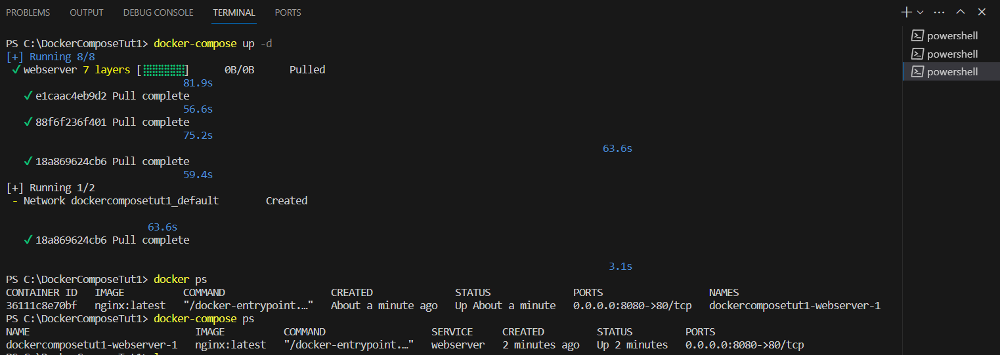

# Bài báo cáo
Sinh viên Nguyễn Công Thiên - 21020406
***
## 1. Docker là gì?
***Docker*** là một nền tảng cho developers và sysadmin để `develop`, `deploy` và `run application` với container. Nó cho phép tạo các môi trường độc lập và tách biệt để khởi chạy và phát triển ứng dụng và môi trường này được gọi là `container`. Khi cần deploy lên bất kỳ server nào chỉ cần run `container` của Docker thì application của bạn sẽ được khởi chạy ngay lập tức.

    Hiểu ngắn gọn: Docker là công cụ giúp ta có thể chạy project ở một môi trường cụ thể, được định sẵn rõ ràng,
    độc lập với môi trường gốc. Các ứng dụng chạy trong Docker được gọi là các Container
### 1.1 Docker hoạt động như thế nào?
Docker có hai `khái niệm` chính cần hiểu, đó là `image` và `container`:

`Image` này không phải là một file vật lý mà nó chỉ được chứa trong Docker. Một image bao gồm `hệ điều hành` (Windows, CentOS, Ubuntu, …) và các `môi trường` lập trình được cài sẵn (httpd, mysqld, nginx, python, git, …)

`Container`: Tương tự như một máy ảo, xuất hiện khi mình khởi chạy `image`. Đặc biệt, tốc độ khởi chạy container `nhanh hơn` máy ảo rất nhiều.
### 1.2 Các câu lệnh cơ bản trong Docker
`docker image`: Liệt kê các images hiện có

`docker rmi {image_id/name}`: Xóa một image

`docker ps`: Liệt kê các container đang chạy

`docker rm` -f {container_id/name}: Xóa một container

`docker start` {new_container_name}: Khởi động một container

## 2. Docker-compose là gì?
***Docker-compose*** là tool để cấu hình và chạy nhiều `docker container` cùng lúc. Dùng docker-compose sẽ giúp ta dễ dàng hơn trong việc chạy cùng lúc 1 hoặc 1 số container cần thiết cho project, đồng thời giúp ta dễ dàng visualize (nhìn) tổng quan về project.
## 3. Linux?
 ### 3.1 Ưu điểm
- Có mã nguồn mở và miễn phí
- Đa dạng và linh hoạt
- Có cộng đồng người dùng lớn và hệ thống hỗ trợ mạnh mẽ
- Tính bảo mật cao
### 3.2 Nhược điểm
- phần mềm hỗ trợ còn hạn chế
- Một số nhà sản xuất không có Driver hỗ trợ hệ điều hành Linux.
## 4. Unix?
### 4.1 Ưu điểm
- Ổn định và tin cậy
- Tiêu chuẩn hóa
- Hỗ trợ và tài liệu phong phú

### 4.2 Nhược điểm
- giá cả
- hạn chế về sự linh hoạt

## 5. BSD
### 5.1 Ưu điểm
- Độ ổn định cao
- Bảo mật mạnh mẽ
- Hiệu suất tốt
- Sự linh hoạt và tùy chỉnh
### 5.2 Nhược điểm
- Số lượng ứng dụng hạn chế.
- Hạn chế về tài liệu và cộng đồng.
- Hạn chế cho người mới.
## 6. *NIX?
### 6.1 Ưu điểm
- Ổn định và bảo mật.
- Đa dạng và linh hoạt.
- Cộng đồng và tài nguyên phong phú.
- Mạnh mẽ và tùy chỉnh.

### 6.2 Nhược điểm
- Số lượng ứng dụng có thể hạn chế.
- Hỗ trợ phần cứng hạn chế.

## 7. macOS thuộc loại nào?
**macOS** được phân loại là một hệ điều hành `Unix` nhưng nó cũng có một số điểm *khác biệt* so với các hệ điều hành Unix khác:
- *nguồn gốc:* `macOS` được phát triển bởi Apple trong khi các hệ điều hành Unix khác như Linux, FreeBSD và OpenBSD có nguồn gốc từ các dự án và nhóm phát triển khác nhau.
- *Tương thích phần cứng:* `macOS` được thiết kế đặc biệt để tương thích phần cứng đa dạng và phong phú hơn. Điều này tạo ra một *sự khác biệt* trong việc hỗ trợ phần cứng so với các hệ điều hành Unix khác

## 8. Alpine với Unbutu?
**Alpine Linux** và **Ubuntu** là hai hệ điều hành Linux phổ biến trong cộng đồng phát triển phần mềm. Mỗi hệ điều hành này có những ưu điểm và đặc điểm riêng.
`Alpine` là một bản phân phối hệ điều hành Linux nhẹ và bảo mật. Nó được thiết kế để chạy trên các môi trường có tài nguyên hạn chế như hệ thống nhúng và container. 
`Ubuntu` là một bản phân phối Linux phổ biến và rất đa dụng.
`Alpine Linux` thích hợp cho các ứng dụng yêu cầu tài nguyên thấp, đặc biệt là trong các môi trường nhúng và container. `Ubuntu` thích hợp cho các ứng dụng đa dạng, từ máy tính cá nhân đến máy chủ doanh nghiệp.
- Nếu bạn cần một hệ điều hành nhẹ, bảo mật và tập trung vào `container`, thì `Alpine` Linux có thể là một lựa chọn tốt.
- Nếu bạn đang tìm kiếm một hệ điều hành đa dụng, có nhiều lựa chọn gói phần mềm và cộng đồng hỗ trợ mạnh mẽ, thì `Ubuntu` là một lựa chọn phổ biến.

## 9. VNC?
### 9.1 VNC là gì?
VNC (Virtual Network Computing) là một công nghệ kĩ thuật dùng để chia sẻ giao diện màn hình từ xa (remote desktop sharing). VNC giúp người dùng hiển thị được màn hình của máy tính hoặc hệ thống ở xa ngay trên máy tính local của người dùng và có thể điều khiển thao tác qua kết nối mạng.
### 9.2 VNC hoạt động như thế nào?
VNC hoạt động theo cơ chế `client/server` và sử dụng giao thức `VNC`. Giao thức VNC vô cùng đơn giản chỉ phục vụ cho một mục đích duy nhất đó là truy cập kênh giao diện đồ hoạ của máy tính người dùng ở xa qua mạng.

### 9.3 Ưu điểm
- Kết nối máy tính từ xa, quản lý, xem theo dõi,…
- Kết nối được từ các phương tiện như laptop, điện thoại thông minh,..

### 9.4 Nhược điểm
- Phụ thuộc đường truyền mạng.
- Ứng dụng có thể nặng nề.
- Hiệu suất thao tác đôi khi hơi chậm và không ổn định.
- Độ bảo mật không cao.

---
Thực hành

